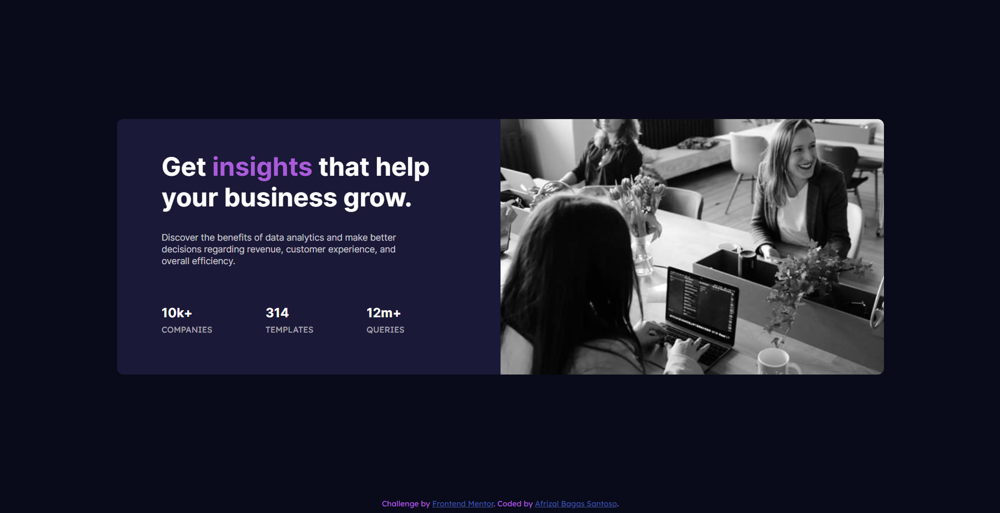
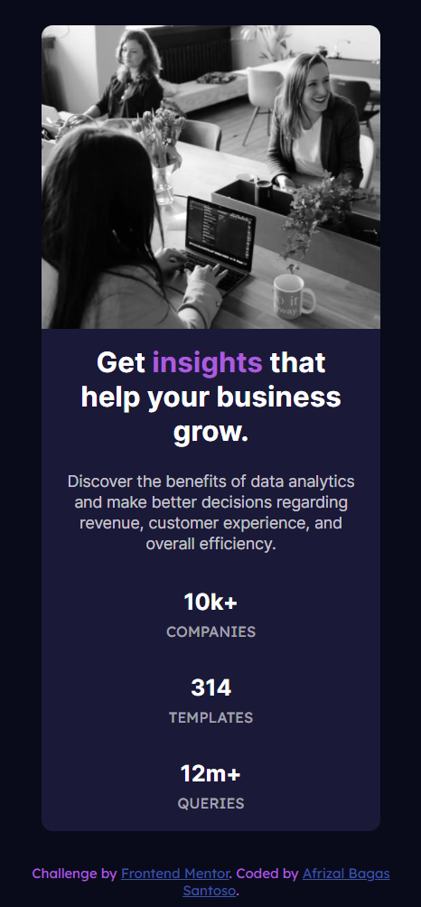

# Frontend Mentor - Stats preview card component solution

This is a solution to the [Stats preview card component challenge on Frontend Mentor](https://www.frontendmentor.io/challenges/stats-preview-card-component-8JqbgoU62). Frontend Mentor challenges help you improve your coding skills by building realistic projects.

## Table of contents

- [Overview](#overview)
  - [The challenge](#the-challenge)
  - [Screenshot](#screenshot)
  - [Links](#links)
- [My process](#my-process)
  - [Built with](#built-with)
  - [What I learned](#what-i-learned)
- [Author](#author)

## Overview

### The challenge

Users should be able to:

- View the optimal layout depending on their device's screen size

### Screenshot

Here the result of my first challenge from Frontend Mentor

Desktop Version 👇



Mobile Version 👇



### Links

- Solution URL: [Soon](https://your-solution-url.com) 🔜
- Live Site URL: [Soon](https://your-live-site-url.com) 🔜

## My process

### Built with

- Semantic HTML5 markup
- CSS
- Flexbox

### What I learned

Saya belajar menggunakan fungsi css yaitu flexbox untuk mengatur layout dari desain project

here the code snippets, see below:

```css
.pages {
  display: flex;
  flex: 1;
  flex-direction: column;
  justify-content: center;
  align-items: center;
}
```

## Author

- Website - [Soon](https://github.com/Afrizalbs) 🔜
- Frontend Mentor - [@Afrizalbs](https://www.frontendmentor.io/profile/Afrizalbs)
- Twitter - [@afrizalbagas](https://twitter.com/afrizalbagas)
